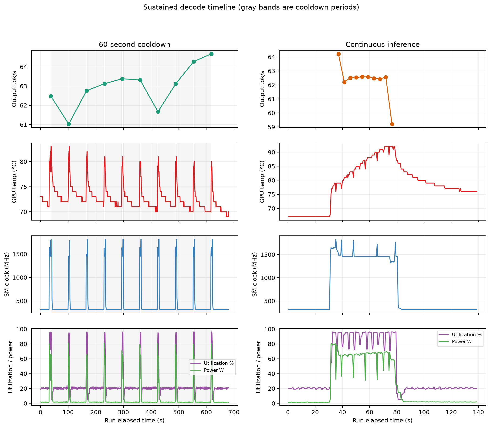

# LLM Inference Lab

An independent, experiment-driven project for learning how large language model inference systems behave, where their bottlenecks come from, and how serving performance can be improved.

The lab combines controlled synthetic workloads with public or purpose-built representative workloads. Its experiments are designed around inference behavior rather than any one application.

## Goals

The project has three required learning goals:

1. **Optimize inference through configuration and model understanding.** Run controlled experiments and explain the results using prefill, autoregressive decode, batching, scheduling, KV-cache behavior, memory use, and model execution.
2. **Profile the system to find bottlenecks.** Trace measured performance problems through the request path and use profiler evidence before selecting an optimization.
3. **Make one change below the client and configuration layers.** Modify one serving-runtime execution path, then validate the change with controlled A/B measurements and correctness checks.

The intended progression is:

```text
benchmark -> characterize -> profile -> hypothesize -> modify -> remeasure -> explain
```

## Ollama Baseline Harness

The first vertical slice is implemented as a reproducible, UI-independent benchmark harness for the current Ollama system. It can:

- replay versioned workloads;
- capture per-request latency, token, throughput, and failure data;
- replay prompt/output shapes with configurable repetitions, closed-loop concurrency, and model keep-alive;
- preserve complete experiment manifests and raw results;
- validate structured-output correctness and task quality alongside speed.

Ollama is the functional baseline. vLLM and SGLang are planned optimized-engine targets once the harness and measurement contract are stable.

### Quick start

Requirements:

- Python 3.11 or newer;
- a running local Ollama server;
- the benchmark model installed in Ollama.

```powershell
python -m venv .venv
.venv\Scripts\python.exe -m pip install -e .
ollama pull qwen3:4b-instruct

.venv\Scripts\inference-lab.exe validate-workload workloads\smoke
.venv\Scripts\inference-lab.exe run `
  --engine ollama `
  --model qwen3:4b-instruct `
  --workload workloads\smoke `
  --warmup 1 `
  --repetitions 3 `
  --concurrency 1
```

The smoke bundle contains short-control, prefill-heavy, and decode-heavy synthetic scenarios. It validates the measurement path; it is not a model-quality benchmark.

Each run creates a private, ignored artifact directory:

```text
runs/<run-id>/
  manifest.json       # engine, model, workload, environment, and run settings
  requests.jsonl      # one raw record per warmup and measured request
  summary.json        # aggregates computed from measured requests only
  events.jsonl        # run, phase, request, gate, and cooldown boundaries
  gpu_telemetry.jsonl # optional synchronized NVIDIA samples
  stream_events.jsonl # optional privacy-safe streamed-token timing metadata
```

Generated text is hashed but not stored unless `--capture-output` is explicitly supplied. The harness records client-observed TTFT and end-to-end latency alongside Ollama's engine-reported token counts and duration fields. Stream events are counted but are not assumed to correspond one-to-one with tokens.

Experiments can optionally request selected-token logprobs solely to count how many
tokens each streamed event represents. The resulting private `stream_events.jsonl`
stores timing, counts, and character lengths--not token identities, generated text,
or probability values. These measurements are client-observed stream arrival times,
not GPU kernel timestamps.

## Experiments

Versioned studies live under `experiments/`. An experiment specification declares
its question, hypothesis, conditions, trials, controls, and telemetry. The experiment
runner expands that specification into concrete low-level benchmark runs while keeping
all raw artifacts private under `runs/`.

```powershell
.venv\Scripts\inference-lab.exe experiment validate `
  experiments\exp-001-thermal-soak

.venv\Scripts\inference-lab.exe experiment run `
  experiments\exp-001-thermal-soak

.venv\Scripts\python.exe `
  experiments\exp-001-thermal-soak\analysis.py
```

Install the optional plotting dependencies before running an experiment analysis:

```powershell
.venv\Scripts\python.exe -m pip install -e ".[analysis]"
```

The first study compares continuous decode against a 60-second cooldown condition
while sampling GPU temperature, utilization, clocks, power, memory, performance state,
and clock-limiting reasons. See the [experiment index](experiments/README.md).

Its preliminary result found that cooldown reduced the maximum measured temperature
from 92°C to 83°C while median active decode throughput remained similar (62.52 versus
63.12 tokens/s). Continuous inference showed a clock and throughput drop on its final
request, but one trial per condition is not enough to establish a general throttling
curve. Read the [full report](experiments/exp-001-thermal-soak/report.md).



Two follow-up protocols are ready but have not been run:

- [Experiment 002](experiments/exp-002-continuous-thermal-drift/report.md) repeats
  sustained 256-token decode across three thermally matched trials.
- [Experiment 003](experiments/exp-003-intra-request-decode-latency/report.md) measures
  client-observed token interarrival timing across five 4,096-token responses.

Both use a post-warmup GPU-state gate so measurement waits for sustained temperature
and utilization thresholds instead of assuming a fixed sleep produces comparable
starting conditions.

### Tests

The harness has no runtime package dependencies. Run the deterministic test suite without Ollama:

```powershell
$env:PYTHONPATH = "src"
python -m unittest discover -s tests -v
```

## Experimental Focus

The repository will contain:

- independent workload definitions, replay, and synthetic load generation;
- Ollama, vLLM, and SGLang benchmark adapters and launch configurations;
- experiment manifests, measurement code, profiler tooling, results, and plots;
- configuration-level optimization studies;
- the profiler-motivated runtime modification.

## Scope

The core scope is local-first, single-node LLM inference with one controlled model family where practical. It includes representative and synthetic workloads, configuration experiments, serving-engine comparisons, profiling, and one focused runtime-internal modification.

The following are not completion requirements:

- training or fine-tuning;
- broad model leaderboards;
- Kubernetes, autoscaling, high availability, or multi-region deployment;
- distributed or multi-node serving;
- building a complete serving engine;
- multiple unrelated runtime forks;
- Triton or CUDA kernel work.

Kernel work may become a later extension after the serving roadmap is complete.

## Documentation

- [Systems Roadmap](docs/roadmap.md) — phases, experiments, completion criteria, and scope boundaries.
- [Benchmark Methodology](docs/benchmark-methodology.md) — workloads, metrics, controls, reproducibility, quality, and reporting rules.
- [Workload Design](docs/workload-design.md) — portable scenario format, workload families, validation, and dataset handling.
- [Experiments](experiments/README.md) — specifications, reports, and headline findings.

## Status

The Phase 1 measurement spine, specification-driven experiment runner, synchronized
GPU telemetry, and first preliminary Ollama thermal study are implemented. Continuous
thermal-drift and intra-request stream-latency follow-ups are configured and ready for
manual execution. Neither follow-up has results yet.

## Guiding Principle

> Use controlled workloads to characterize, profile, and optimize LLM inference across serving engines and runtime configurations, then make one evidence-driven runtime change and explain why performance changed.
