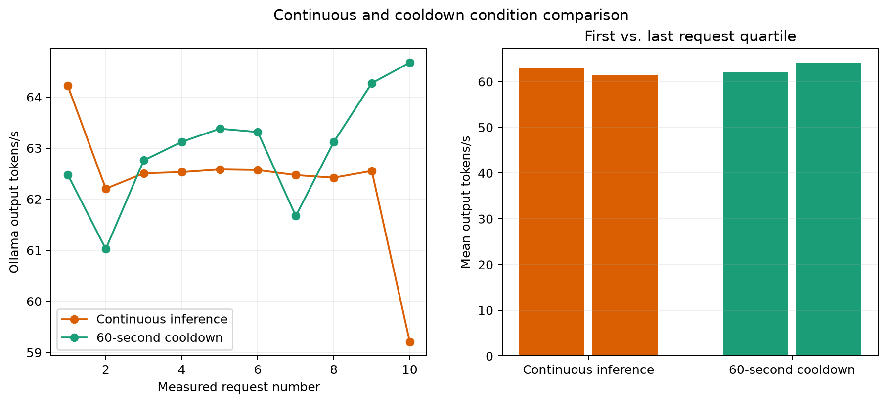
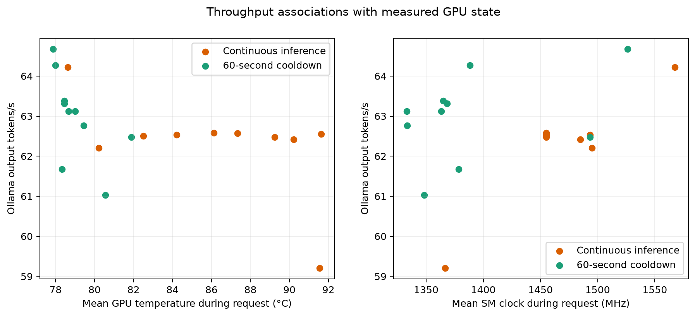

# Effect of Cooldown on Sustained Decode Performance

**Status:** Completed preliminary study  
**Experiment ID:** `exp-001-thermal-soak`  
**Execution ID:** `20260819T052318Z-dcf0a21f`  
**Run date:** 2026-08-19

## Question

Does allowing a laptop GPU to cool between otherwise identical decode requests
prevent the throughput degradation observed during sustained local inference?

## Hypothesis

Continuous decode will raise GPU temperature and eventually reduce effective SM
clocks, causing output throughput to fall. A 60-second cooldown between requests
should keep the GPU cooler and preserve more of its initial active decode throughput.

## System Under Test

- Windows 11, Python 3.14.3, Ollama 0.32.14
- NVIDIA GeForce GTX 1660 Ti laptop GPU, 6 GiB VRAM, driver 566.36
- `qwen3:4b-instruct`, 4.0B parameters, GGUF Q4_K_M
- Model digest `0edcdef34593eac1aa2be9c7d06c432dcf81945adca5eca2f27662c18f168ba0`
- Single request concurrency with the model kept resident for 30 minutes

The repository was intentionally dirty because this execution measured the newly
implemented harness. The commit recorded in the run manifest is `115f54d`.

## Method

The synthetic workload used a fixed 68-token prompt and forced 256 generated tokens.
Every measured response completed successfully with `done_reason=length`; generated
text was hashed but not retained.

Two conditions were run with one excluded exact-prompt warmup and ten measured
requests each:

1. **60-second cooldown:** wait 60 seconds between requests, excluding after the last.
2. **Continuous inference:** issue the next request immediately after completion.

The seeded randomized order selected cooldown first. A 120-second gap separated the
conditions. GPU telemetry covered pre-roll, warmup, measurement, cooldown, and
post-roll at a configured 500 ms interval. The cooldown run recorded 1,270 samples;
the continuous run recorded 262. Neither run had missing telemetry fields.

## Results

| Metric | Continuous | 60-second cooldown |
| --- | ---: | ---: |
| Successful measured requests | 10/10 | 10/10 |
| Median active decode throughput | 62.52 tok/s | 63.12 tok/s |
| First request-quartile mean | 62.98 tok/s | 62.09 tok/s |
| Last request-quartile mean | 61.39 tok/s | 64.02 tok/s |
| First-to-last change | -2.52% | +3.11% |
| Mean request temperature | 86.17°C | 79.07°C |
| Maximum measured temperature | 92°C | 83°C |
| Measurement wall time | 43.78 s | 585.52 s |
| Effective wall throughput | 58.47 tok/s | 4.37 tok/s |


Continuous throughput was stable near 62.2–62.6 tok/s for requests two through nine.
The tenth request fell to 59.20 tok/s as its mean SM clock fell to 1,367 MHz with a
1,320 MHz minimum, compared with the preceding steady level near 1,455 MHz. Its mean
temperature was 91.6°C. This endpoint accounts for much of the continuous condition's
first-to-last decline.



The cooldown condition reduced temperature substantially and ended faster than it
started, but its median active decode advantage over continuous inference was only
0.60 tok/s, or approximately 1%. Its intentional 540 seconds of idle time reduced
effective wall throughput by more than 92%.



NVIDIA reported software thermal limiting in 82 of 85 continuous measurement samples
and 66 of 88 cooldown measurement samples. It reported no hardware thermal slowdown,
general hardware slowdown, or hardware power-brake samples in either condition.

Median TTFT was 260 ms for continuous requests and 464 ms for cooldown requests.
Ollama's median prompt-evaluation duration was 17.6 ms continuously but 212.8 ms after
cooldown gaps. The experiment cannot identify the cache mechanism, but this is
consistent with repeated immediate requests benefiting from prompt-state reuse that
was not preserved in the same way across 60-second gaps.

The sanitized measurements and aggregates are available in
[`results/`](results/aggregate.csv).

## Interpretation

The data supports a limited version of the hypothesis. Continuous decode clearly
heated this small laptop GPU, and the final request combined lower clocks with lower
throughput while a software thermal event was active. Cooldown prevented that thermal
accumulation and maintained active decode speed.

It does **not** show a broad throughput collapse during this short continuous trial.
Nine of ten continuous requests remained close to 62.5 tok/s despite rising
temperature. The evidence is better described as the onset of thermally constrained
behavior than as proof of a stable long-run degradation curve.

Cooldown is also not a throughput optimization for a continuously busy service. It
traded a small active-speed benefit for a very large wall-throughput loss. It could
still be useful for protecting thermals or preserving latency in an intermittent
personal workload, but that is a different objective.

## Limitations

- There was only one trial per condition, so no confidence interval, p95 comparison,
  or causal claim is justified.
- The randomized order placed cooldown first and continuous second. The 120-second gap
  reduced but did not eliminate order, ambient, or chassis heat effects.
- Idle GPU utilization was approximately 20%, indicating unavoidable desktop or
  background GPU activity.
- `nvidia-smi` samples system-level state at about 500 ms resolution and cannot explain
  individual kernels or sub-step model execution.
- Software thermal-event flags were present even in many cooler requests. The reported
  flag is evidence of clock management, not a direct measurement of exact lost work.
- Mean clock comparisons across conditions are affected by the cooldown condition
  repeatedly ramping from idle clocks at request boundaries.
- The workload intentionally truncates at 256 tokens and says nothing about semantic
  model quality.

The next step should repeat both conditions at least three times with counterbalanced
order, then run a longer continuous soak to determine whether the final-request drop
persists or was an isolated event.

## Conclusion

A 60-second cooldown kept the GTX 1660 Ti materially cooler and avoided the final
clock/throughput drop observed during continuous inference. Active decode throughput
was otherwise similar between conditions, while cooldown reduced useful wall
throughput drastically. The preliminary result motivates replication and a longer
soak; it does not yet establish a general thermal-throttling curve.

## Reproduction

```powershell
.venv\Scripts\python.exe -m pip install -e ".[analysis]"
.venv\Scripts\inference-lab.exe experiment validate `
  experiments\exp-001-thermal-soak
.venv\Scripts\inference-lab.exe experiment run `
  experiments\exp-001-thermal-soak
.venv\Scripts\python.exe `
  experiments\exp-001-thermal-soak\analysis.py
```

To reproduce these exact figures from retained local raw data:

```powershell
.venv\Scripts\python.exe `
  experiments\exp-001-thermal-soak\analysis.py `
  --execution-id 20260819T052318Z-dcf0a21f
```
