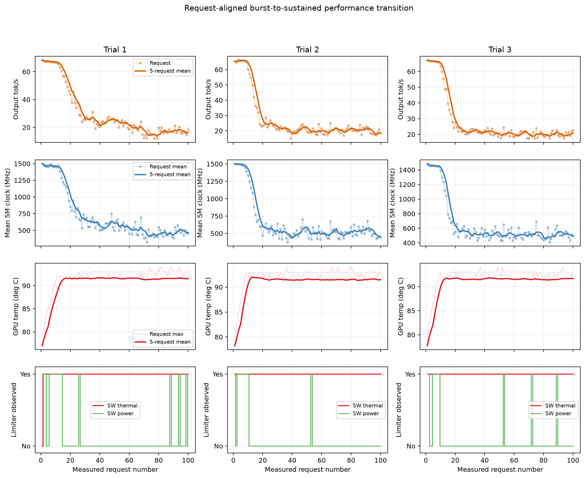
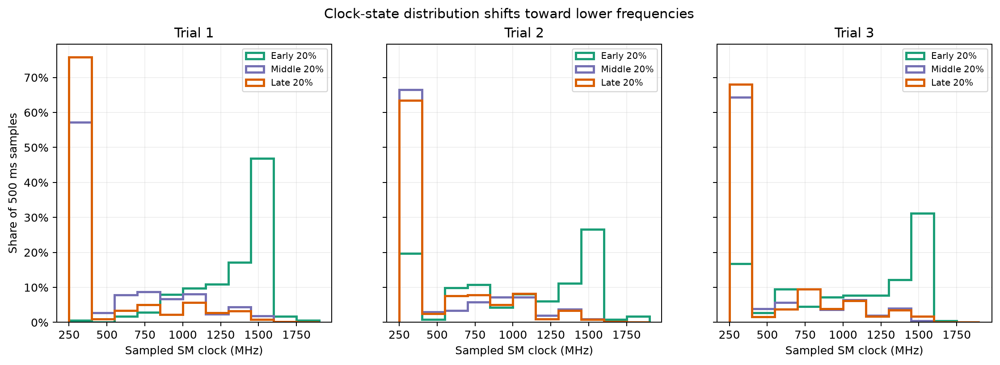
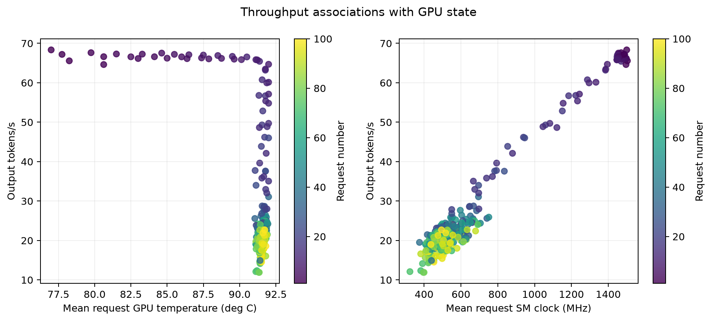

# Burst Versus Sustained LLM Inference on a Laptop GPU

**Status:** Complete

**Experiment ID:** `exp-002-continuous-thermal-drift`

**Execution ID:** `20260821T155136Z-de129ed2`
**Executed:** August 21, 2026

## Question

How different is short-duration, burst inference performance from the throughput
that my personal laptop can sustain during continuous LLM decoding? If performance falls,
does GPU telemetry identify thermal clock management as a plausible mechanism?

## Hypothesis

Short runs will overestimate the laptop's sustained inference capacity. Continuous
decode will raise GPU temperature, after which thermal clock management will reduce
SM clocks. Later requests will therefore have lower output tokens per second and
higher engine TPOT than the initial burst.

Temperature rising while clocks and decode performance remain stable would challenge
that mechanism. Performance drift without corresponding GPU-state changes would
suggest another cause, such as background load, power limiting, or runtime behavior.

## System Under Test

- Windows 11 (`10.0.22631`), CPython 3.14.3
- Ollama 0.32.14
- NVIDIA GeForce GTX 1660 Ti Laptop GPU, 6 GiB VRAM, driver 566.36
- `qwen3:4b-instruct`, 4.0B parameters, GGUF `Q4_K_M`
- Model digest: `0edcdef34593eac1aa2be9c7d06c432dcf81945adca5eca2f27662c18f168ba0`
- Harness commit: `99a5943ddfc23ad548bc48a9fc645b84ec18500e`
- GPU UUID was captured in the private run manifests and was consistent across trials.
- AC-power state, Windows power/fan mode, laptop placement, and ambient temperature
  were not captured automatically and are therefore treated as uncontrolled metadata.

## Method

The study used the public `decode-soak-v1` workload: one short, fixed synthetic
prompt with deterministic generation settings and a 256-token output limit. Reaching
the length limit was expected; this was a systems-load experiment, not a quality
benchmark. Generated text was not retained.

Each of the three trials contained one excluded exact-prompt warmup followed by 100
measured requests at concurrency 1, with no delay between requests. Ollama kept the
model resident for 30 minutes. NVIDIA telemetry was sampled every 500 ms from a
30-second pre-roll through a 60-second post-roll.

After warmup, a start gate required ten consecutive samples at or below 70 degrees C
and at or below 25% GPU utilization. The three gate windows had mean temperatures of
69.5, 70.0, and 70.0 degrees C, a range of 0.5 degrees C. All three gates were
independently verified from the stored telemetry, and all starts satisfied the
predefined 3-degree comparability threshold.

The primary performance metrics were Ollama engine output tokens per second and
engine TPOT (`eval_duration / eval_count`). Telemetry was interval-joined to each
request to summarize GPU temperature, SM clock, utilization, power, and limiter
flags. The first and last 20% of each trial were compared within trial. Each trial,
not each request, was treated as an independent replicate.

## Results

All 300 measured requests completed successfully with exactly 256 output tokens and
`done_reason=length`. All three 100-request trials and their required telemetry were
complete.

### Primary finding: burst throughput was not sustainable throughput

The first five requests averaged 67.61, 65.74, and 66.71 tokens/s across the three
trials. The final 20 requests averaged only 17.27, 19.92, and 20.13 tokens/s. A short
benchmark run near the beginning would therefore have overstated sustained serving
capacity by roughly three to four times on this system.

| Trial | Median tok/s | First 20% tok/s | Last 20% tok/s | Change | Median TPOT | TPOT change | Max temp | Min SM clock |
|---:|---:|---:|---:|---:|---:|---:|---:|---:|
| 1 | 23.38 | 61.74 | 17.27 | -72.03% | 42.78 ms/token | +254.12% | 94 C | 300 MHz |
| 2 | 21.43 | 51.45 | 19.92 | -61.29% | 46.66 ms/token | +126.04% | 94 C | 300 MHz |
| 3 | 21.39 | 53.12 | 20.13 | -62.10% | 46.74 ms/token | +135.83% | 94 C | 300 MHz |

Across the three trial-level comparisons, the mean first-to-last throughput change
was -65.14%, and the mean TPOT change was +171.99%. The median of the three trial
median throughputs was 21.43 tokens/s.

The early-to-late shift was repeatable. During the first five requests, mean request
SM clocks were 1468, 1498, and 1462 MHz. During the final 20 requests, mean SM clocks
had fallen to approximately 467, 518, and 511 MHz. The final segments averaged
approximately 91.5--91.6 degrees C.

Software thermal limiting was observed in 99, 100, and 100 measured requests,
respectively. Software power limiting appeared in 16, 10, and 10 requests. No
hardware thermal, hardware slowdown, or external power-brake flags were observed.
The GPU reached 94 degrees C in every trial.



The request-aligned view summarizes the raw 500 ms telemetry within each request and
adds five-request rolling means. It shows the same transition in every trial:
throughput and mean SM clock decline together over approximately the first 20--30
requests, while temperature rises into its plateau and the software thermal limiter
remains active. Summarizing by request avoids implying that the rapidly sampled clock
values form one smooth continuous signal.



The clock-distribution view explains what the falling request mean represents. Early
segments contain a large share of observations near the GPU's boosted clock. Middle
and late segments shift strongly toward the 300 MHz state, although occasional
higher-clock observations remain. Each curve is normalized independently and shows
the share of observed 500 ms samples, not an exact measurement of time at each clock.




The association plot shows that SM clock is a much more direct predictor of observed
throughput than temperature alone. Temperature mainly identifies the transition into
the hot regime; within the roughly 91-92 degree C plateau, different clock levels
correspond to substantially different throughput.

Additional views:

- [Normalized performance trajectory](figures/normalized-performance-trajectory.svg)
- [First-versus-last segment comparison](figures/first-vs-last-segments.svg)
- [Vector request-aligned figure](figures/continuous-thermal-timeline.svg)
- [Vector clock-distribution figure](figures/clock-state-distributions.svg)
- [Vector raw-clock zoom](figures/raw-clock-zoom.svg)
- [Machine-readable trial summary](results/trial-summary.csv)
- [Per-request measurements](results/measurements.csv)


## Interpretation

### The important distinction is burst capacity versus sustained capacity

The most useful result is not merely that lower clock speeds produced fewer tokens
per second. It is that the hardware exposed two substantially different performance
regimes without any change to the model, prompt, output length, or engine settings:

1. an initial burst near 67 tokens/s while the GPU sustained clocks near 1.5 GHz;
2. a thermally managed regime near 17--20 tokens/s with late-segment mean clocks near
   0.5 GHz.

This distinction changes how the machine should be benchmarked and provisioned. A
few short requests measure burst performance, but a local service handling long jobs
or back-to-back users must be sized using sustained performance. Using the initial
rate would substantially underestimate completion time and overestimate how much
traffic the laptop can serve.

It also explains why identical inference requests can slow down over a session. The
software workload can remain constant while the hardware operating point changes.
For an interactive application, that may appear as fast responses at first followed
by slower streaming and longer queue occupancy after sustained use.

### Temperature is the trigger signal, not the direct performance control

The result supports a thermal-management mechanism under this workload. Continuous
inference heated the GPU into a stable high-temperature region, NVIDIA reported
software thermal limiting, the SM clock fell, output throughput fell, and engine
TPOT rose. The same sequence occurred in all three trials from closely matched
starting states.

This does **not** mean that each additional degree directly determines token rate.
The GPU spent much of each trial around 91--92 degrees C while throughput varied. A
more useful model is that reaching the thermal region caused the GPU's controller to
reduce clocks to keep temperature bounded. Temperature then appeared relatively flat
because performance had already been traded away. SM clock was consequently much
more directly associated with throughput within the hot regime.

Intermittent software power limiting may also have contributed, but it was present in
far fewer requests than software thermal limiting. This experiment does not yet
separate every contribution from cooling, shared chassis limits, or the laptop's
firmware power policy.

### What this means for inference benchmarking

This experiment demonstrates why one tokens-per-second number is inadequate for a
thermally constrained serving system. At minimum, future results on this laptop
should distinguish:

- cold or burst throughput;
- time to enter the constrained regime;
- sustained or late-window throughput;
- the GPU temperature, clock, power, and limiter state accompanying each result;
- active serving throughput versus wall-clock throughput when recovery pauses are
  introduced.

The study does not establish how much of a single long response's token-by-token
slowdown is caused by thermals versus growing KV-cache work. Experiment 003 is
designed to isolate that separate question.

## Mitigation Opportunities

The experiment identifies the constraint but does not yet prove which intervention
is best. The following are testable mitigation strategies rather than conclusions
from this run.

### Improve the cooling boundary

Increasing fan speed, improving airflow, elevating the laptop, cleaning the cooling
path, or using a cooling pad may delay throttling or raise the sustainable clock. A
controlled follow-up should keep the workload fixed and compare time-to-throttle,
late-window tokens/s, maximum temperature, and noise/power cost across cooling modes.

### Trade peak speed for a more stable operating point

A lower fixed power target or conservative clock may produce worse burst performance
but prevent the sharp collapse seen here. The useful metric would be total tokens
completed over a fixed 20- or 30-minute interval. If a lower-power configuration
maintains steadier clocks, it could outperform an unrestricted configuration over the
entire interval despite starting slower.

This is a particularly valuable inference-engineering experiment because it tests
whether maximizing instantaneous throughput also maximizes useful work over time.

### Add thermal-aware admission control

A local service could delay a new long request, insert a cooldown window, or reduce
concurrency when the GPU enters its constrained regime. That may improve latency for
the requests that are admitted, but it also adds scheduled idle time. Any evaluation
must therefore report both active request latency and total wall-clock throughput;
otherwise cooldown can appear beneficial while completing less work overall.

### Reduce the work or memory pressure per request

Smaller or more aggressively quantized models, shorter outputs, speculative decoding,
or a different serving runtime may reduce time spent at maximum load. These changes
also affect quality, memory usage, and sometimes hardware utilization, so they require
quality checks and cannot be judged from temperature alone.

### Set expectations at the application layer

If the hardware cannot sustain burst speed, applications should estimate long-task
latency from the measured steady-state rate, expose realistic progress, and avoid
assuming that early streaming speed will continue for the entire job. This does not
remove the bottleneck, but it prevents burst measurements from becoming misleading
product expectations.

## Limitations

- Temperature and elapsed time rose together. This is a replicated observational
  soak, not a randomized intervention that independently manipulates temperature.
- Only one laptop GPU, one model artifact, one quantization, and one synthetic prompt
  were tested. The magnitude should not be generalized to other systems.
- Three trials demonstrate repeatability in this execution but do not support broad
  population-level confidence intervals.
- The start gate bounded GPU temperature and utilization, but it did not control
  ambient temperature, CPU/chassis heat, fan behavior, OS power policy, or unrelated
  background work. These settings were not captured in the run metadata.
- `nvidia-smi` samples whole-device state at approximately 500 ms intervals. It does
  not expose individual kernels or exact token execution intervals.
- The NVIDIA event flags show that clock limiting was active, but sample occupancy is
  not an exact duration measurement.
- The fixed 256-token output measures sustained decode load, not semantic quality or
  diverse production traffic.

Experiment 001's continuous-versus-cooldown intervention is complementary evidence.
The next causal follow-up should repeat this protocol under explicitly recorded
fan/power modes and compare total tokens over a fixed duration for unrestricted,
actively cooled, and conservative-power conditions.

## Conclusion

On the tested GTX 1660 Ti laptop, burst performance was not representative of useful
sustained serving capacity. Identical requests began near 67 tokens/s but the final
segments averaged only 17--20 tokens/s. Across three trials, late-segment throughput
was 61--72% below early-segment throughput, accompanied by a reduction in mean SM
clock from roughly 1.5 GHz during the first five requests to roughly 0.5 GHz during
the final 20 and by near-continuous software thermal-limit signals.

The practical takeaway is that this system should be evaluated and capacity-planned
using its sustained regime, not a short peak benchmark. The next optimization goal
is not necessarily to maximize the first request's speed; it is to increase total
useful tokens over time while keeping latency predictable. Cooling, conservative
power/clock settings, workload shaping, and thermal-aware admission are now concrete
hypotheses to test against that objective.

## Reproduction

Run from the repository root in PowerShell:

```powershell
.venv\Scripts\inference-lab.exe experiment validate `
  experiments\exp-002-continuous-thermal-drift

.venv\Scripts\inference-lab.exe experiment run `
  experiments\exp-002-continuous-thermal-drift
```

Reproduce this analysis from the retained execution:

```powershell
.venv\Scripts\python.exe `
  experiments\exp-002-continuous-thermal-drift\analysis.py `
  --execution-id 20260821T155136Z-de129ed2
```
