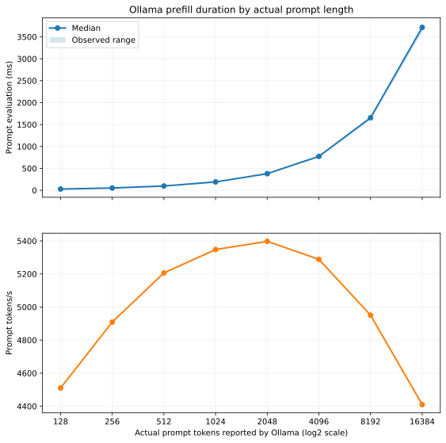
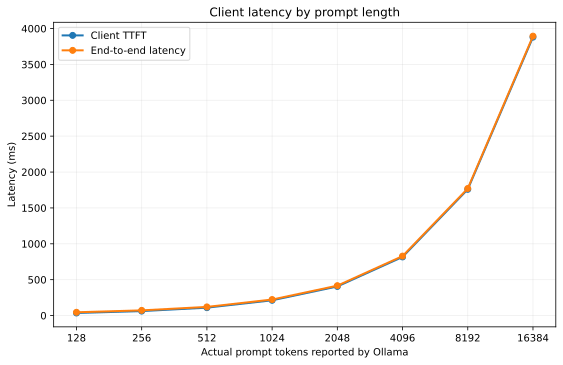

# Ollama Prefill Scaling With Natural-Language Prompt Length

**Status:** Complete
**Experiment ID:** `exp-005-natural-corpus-prefill-scaling`
**Execution ID:** `20260826T175114Z-2f660709`

## Question

How do Ollama prompt-evaluation duration, prompt-processing throughput, client time
to first token, and total latency change as natural-language prompt length increases
on one RTX A6000?

## Hypothesis

Prompt-evaluation duration and client TTFT should increase as actual prompt-token
count increases. Prompt throughput may improve initially as larger prefills use the
GPU more fully, while attention work should eventually make duration grow more
rapidly. Nearly flat prompt-evaluation duration across the tested range would
challenge the hypothesis.

## System Under Test

The measured fixed configuration was:

- Ollama `0.32.15`
- `qwen2.5:7b-instruct`, digest
  `845dbda0ea48ed749caafd9e6037047aa19acfcfd82e704d7ca97d631a0b697e`
- Ollama's packaged Qwen2.5 7B Q4 model artifact
- One NVIDIA RTX A6000 with approximately 48 GB VRAM
- One request at a time and one loaded model
- Flash Attention enabled and f16 KV-cache storage
- A fixed 32,768-token context capacity for every request
- Prompt RAM caching and context checkpoints disabled at server launch

The execution manifests and private Ollama server log are authoritative for the
actual runtime, model digest, GPU UUID, driver, and observed telemetry.

## Method

The workload contains eight prompt sizes: 128, 256, 512, 1024, 2048, 4096,
8192, and 16,384 expected tokens. Source text comes from the raw WikiText-2 training
split, whose ignored local source file has SHA-256
`6707892fa3788b5ab9ed78ab5ff37d9fe825f6011a2ad4fcd6a6d467f0e7da57`.
The generator removes heading-only and blank lines, normalizes WikiText punctuation
markers and whitespace, and verifies the source checksum before sampling.

Each prompt uses a deterministic contiguous window from a widely separated corpus
offset, preventing large shared prefixes between scenarios. The fixed instruction
`Reply with only OK.` appears after the sampled passage so it remains adjacent to
the generation boundary even for the 16K case. The response must exactly match
`OK`; an empty EOS-only response therefore remains an explicit quality failure.

Prompts are constructed and verified with the
`Qwen/Qwen2.5-7B-Instruct` tokenizer at revision
`a09a35458c702b33eeacc393d103063234e8bc28`. Analysis uses Ollama's reported
`prompt_eval_count` as the measured independent variable rather than assuming the
construction target is exact for the packaged model. Every scenario uses:

- context capacity 32,768;
- temperature 0 and seed 42;
- at most eight output tokens;
- thinking disabled;
- an exact-match `OK` response validator;
- concurrency one.

Short and long prompts alternate in workload order so prompt length does not grow
monotonically with request position. Each of three trials performs one complete
warmup pass followed by seven measured passes, producing 21 measured requests per
prompt length and 168 total measured requests. Warmups are excluded from analysis.

The model remains resident for steady-state timing. The launch procedure disables
the runner's prompt RAM cache and context checkpoints. Distinct corpus windows
prevent deliberate natural-language prefix reuse. This is a cache-state control,
not a cache-performance comparison.

Required `nvidia-smi` telemetry is sampled every 100 ms. GPU measurements are
supporting evidence for residency, utilization, clocks, power, and thermal state;
GPU memory is not a primary outcome because the context capacity remains fixed.

## Primary Measurements

- Ollama `prompt_eval_duration`, converted from nanoseconds to milliseconds
- Ollama `prompt_eval_count`
- Engine prompt throughput: `prompt_eval_count / prompt_eval_duration`

Supporting measurements are client TTFT, end-to-end latency, output count, failures,
GPU utilization, temperature, clocks, power, and process-level GPU memory.

The analysis aggregates individual measured requests by target prompt length. It
reports sample count, actual prompt-count range, median, mean, p95, observed range,
and standard deviation for prompt-evaluation duration, plus prompt-throughput and
client-latency summaries.

Published outputs:

- `results/request-measurements.csv`
- `results/prompt-length-aggregate.csv`
- `results/analysis-manifest.json`
- `figures/prefill-scaling.svg` and `.png`
- `figures/client-latency-scaling.svg` and `.png`

## Results

The full three-trial experiment completed on August 26, 2026 in 3 minutes 35
seconds. All 168 measured requests returned successfully and passed the exact-match
`OK` validator. Ollama reported exactly the target prompt-token count at every
length, and every response contained two output tokens.

The first request of the first warmup pass spent 3,616 ms loading the model. It was
excluded from the measured data, as were all 24 warmup requests. The first measured
128-token request had a 28.4 ms engine prompt-evaluation duration and 46.8 ms
end-to-end latency, confirming that cold loading did not enter the primary results.

| Prompt tokens | Samples | Median prefill (ms) | P95 prefill (ms) | Median prompt tokens/s | Median TTFT (ms) | Median E2E (ms) |
| ---: | ---: | ---: | ---: | ---: | ---: | ---: |
| 128 | 21 | 28.38 | 29.40 | 4,510 | 35.36 | 45.61 |
| 256 | 21 | 52.15 | 53.42 | 4,909 | 61.77 | 72.23 |
| 512 | 21 | 98.34 | 99.28 | 5,206 | 109.70 | 120.44 |
| 1,024 | 21 | 191.48 | 193.71 | 5,348 | 212.35 | 223.09 |
| 2,048 | 21 | 379.44 | 382.08 | 5,397 | 405.36 | 416.48 |
| 4,096 | 21 | 774.52 | 782.12 | 5,288 | 816.68 | 828.57 |
| 8,192 | 21 | 1,654.78 | 1,667.02 | 4,951 | 1,758.83 | 1,770.70 |
| 16,384 | 21 | 3,715.34 | 3,749.69 | 4,410 | 3,879.70 | 3,894.03 |



The shared x-axis is logarithmic (base 2). Each horizontal step therefore represents
a doubling of the actual prompt tokens reported by Ollama; this makes the change in
scaling rate visible without crowding the shorter prompts at the left edge.

Prompt throughput increased by 19.7% from 4,510 tokens/s at 128 tokens to a peak
of 5,397 tokens/s at 2,048 tokens. It then declined by 18.3% from that peak to 4,410
tokens/s at 16,384 tokens. From 2,048 to 16,384 tokens, an 8x increase in prompt
length produced a 9.8x increase in median prompt-evaluation duration. The
greater-than-linear growth at the long-prompt end is visible both as an upward bend
in duration and as falling throughput.



Client TTFT closely followed engine prompt-evaluation duration. The median gap
between the two increased from about 7 ms at 128 tokens to 164 ms at 16,384 tokens;
the two-token response then added roughly 10--14 ms to end-to-end latency. Timing
variance within each prompt length was low: prompt-evaluation standard deviation
was at most 1.4% of its mean.

GPU memory remained exactly 6,628 MiB throughout the measured phases, consistent
with one resident model and the fixed 32K KV-cache allocation. Mean measured-phase
GPU utilization was 82--85%, with samples reaching 100%. The GPU warmed from
46--70 C during trial 1 to 75--82 C during trial 3. No software thermal, hardware
thermal, or hardware slowdown flags were recorded.

Long-prompt medians nevertheless slowed across the fixed-order trials: the
16,384-token median increased from 3,628.8 ms in trial 1 to 3,743.5 ms in trial 3,
a 3.2% increase. The corresponding 4K and 8K increases were both about 2.9%. The
temperature and timing changes are correlated, but this experiment does not isolate
temperature as their cause.

## Interpretation Guide

| Observation | Interpretation |
| --- | --- |
| Duration rises roughly proportionally while throughput is stable | Prefill cost scales approximately linearly over that range |
| Throughput rises at first | Larger prefills are using the GPU more efficiently |
| Duration bends upward and throughput falls at larger prompts | Attention or another length-dependent cost is growing faster than useful prefill work |
| Engine duration rises but TTFT rises substantially more | Client/runtime overhead outside measured prompt evaluation is also changing |
| Engine duration remains nearly flat | The hypothesis is challenged, or prompt reuse/cache control must be rechecked |

## Limitations

- Each prompt length uses one fixed corpus window. Length and passage content are
  therefore not independently randomized, and repetitions estimate timing variance
  rather than variation across natural-language samples.
- WikiText provides ordinary expository prose, but it is not semantically neutral;
  it inherits Wikipedia's topic selection, formatting artifacts, and biases.
- Regenerating the bundle requires the ignored, checksum-pinned WikiText source file.
- Results describe one quantized Ollama artifact, one runtime version, and one GPU;
  they are not a general model-family or engine comparison.
- The fixed 32K context allocation deliberately prevents this experiment from
  interpreting memory changes as per-token KV-cache growth.
- Thirteen short measured requests completed between telemetry samples. This does
  not affect Ollama's primary prompt-evaluation timing, but their request-level GPU
  fields are incomplete.
- Trials ran in fixed order without a cooldown. The roughly 3% long-prompt slowdown
  as the GPU warmed means the aggregate includes a small time/thermal drift; this
  experiment cannot attribute that drift causally.
- The runner environment controlling prompt caching is recorded in the protocol and
  private server log, not automatically captured as an Ollama API model property.
- Expected Hugging Face tokenizer counts may differ slightly from the packaged
  Ollama tokenizer/template. The analysis preserves and uses actual engine counts.

## Conclusion

The results support the hypothesis. Larger prompts initially used the GPU more
efficiently, raising prompt throughput through 2,048 tokens. Beyond that point,
prompt-evaluation duration grew faster than token count and throughput declined,
which is consistent with increasing length-dependent attention work. Client TTFT
tracked the same curve, so the dominant length-dependent latency came from engine
prefill rather than a separate client-side cost.

This establishes the expected single-request Ollama prefill curve on the tested
RTX A6000 configuration. It also identifies two useful follow-ups: repeat the
long-prompt measurements under controlled thermal starting conditions, and compare
the same workload across Ollama, vLLM, and the PyTorch reference while preserving
model precision and runtime controls as closely as possible.

## Reproduction

From a Slurm shell with one GPU, start the private Ollama server with the controlled
runtime configuration:

```bash
cd /common/home/vb471/llm-inference-lab
export PATH=/common/home/vb471/.local/bin:$PATH
export OLLAMA_MODELS=/common/home/vb471/model-cache/ollama
export OLLAMA_HOST=127.0.0.1:11434
export OLLAMA_NO_CLOUD=1
export OLLAMA_NUM_PARALLEL=1
export OLLAMA_MAX_LOADED_MODELS=1
export OLLAMA_CONTEXT_LENGTH=32768
export OLLAMA_FLASH_ATTENTION=1
export OLLAMA_KV_CACHE_TYPE=f16
export LLAMA_ARG_CACHE_RAM=0
export LLAMA_ARG_CTX_CHECKPOINTS=0

OLLAMA_LOG="runs/ollama-exp005-${SLURM_JOB_ID}.log"
ollama serve >"$OLLAMA_LOG" 2>&1 &
OLLAMA_PID=$!
```

Validate the protocol, then run one measured pass as an output preflight:

```bash
.venv/bin/inference-lab experiment validate \
  experiments/exp-005-natural-corpus-prefill-scaling

.venv/bin/inference-lab run \
  --engine ollama \
  --base-url http://127.0.0.1:11434 \
  --model qwen2.5:7b-instruct \
  --workload workloads/synthetic/prefill-scaling-v2 \
  --warmup 0 \
  --repetitions 1 \
  --concurrency 1 \
  --timeout 600 \
  --gpu-telemetry-required
```

All eight preflight requests, especially `prompt-16384`, must report
`quality-ok`. Then run the complete experiment:

```bash
time .venv/bin/inference-lab experiment run \
  experiments/exp-005-natural-corpus-prefill-scaling
```

Analyze this execution:

```bash
.venv/bin/python \
  experiments/exp-005-natural-corpus-prefill-scaling/analysis.py \
  --execution-id 20260826T175114Z-2f660709
```

Stop Ollama after the run:

```bash
kill "$OLLAMA_PID"
wait "$OLLAMA_PID" 2>/dev/null || true
```
