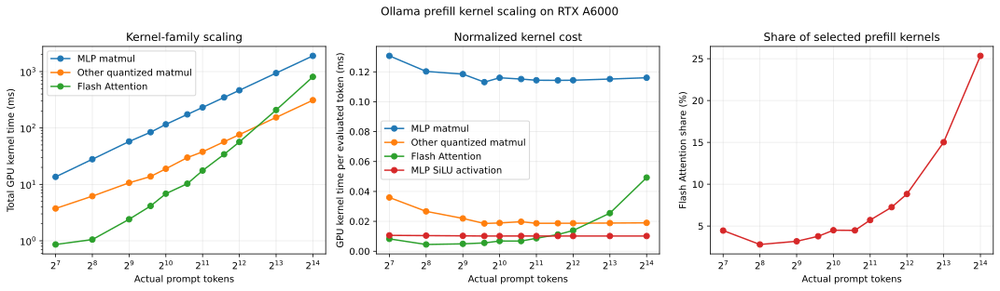
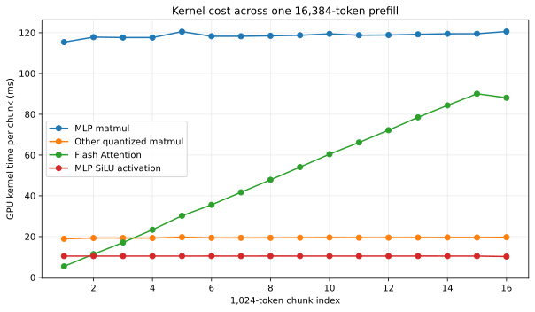

# Ollama Prefill Kernel Scaling With Nsight Systems

**Status:** Complete

**Experiment ID:** `exp-006-ollama-prefill-kernel-scaling`

**Execution ID:** `20260831T172138Z`

## Question

Why did Experiment 5 observe a U-shaped prefill-efficiency curve in which Ollama
prompt throughput improved through roughly 2,048 tokens and then declined at
longer context lengths?

More specifically, does the long-context decline occur because Flash Attention
grows faster than the approximately linear matrix transformations in the MLP and
other projection paths?

## Prior Observation

Experiment 5 measured clean, unprofiled Ollama performance over 21 requests at
each of eight prompt lengths. Median prompt throughput increased from 4,510
tokens/s at 128 tokens to 5,397 tokens/s at 2,048 tokens, then declined to 4,410
tokens/s at 16,384 tokens. An 8x increase from 2,048 to 16,384 prompt tokens
produced a 9.8x increase in median prompt-evaluation duration.

That experiment established the performance curve but did not identify which GPU
operations caused it. Experiment 6 is a separate profiler run intended to explain
that result, not replace its clean timing measurements.

## Hypothesis

Ollama processes long prompts in bounded token chunks. For each full chunk:

- MLP and projection matmuls should process approximately the same number of new
  tokens and therefore take approximately constant time;
- Flash Attention should become more expensive as the number of preceding tokens
  grows because the new queries attend over an increasingly long key/value
  history;
- total MLP and projection time should therefore grow approximately linearly with
  prompt length, while total Flash Attention time should grow more than linearly;
- at short lengths, fixed overhead and improving GPU utilization should reduce
  matmul cost per token before the growing attention term becomes dominant.

The hypothesis would be challenged if Flash Attention time per evaluated token
remained flat at long contexts, if its per-chunk time did not increase with the
preceding context, or if MLP matmul grew at a similar rate.

## System Under Test

The fixed configuration was:

- Ollama `0.32.15`;
- `qwen2.5:7b-instruct`, backed by Ollama blob
  `sha256-2bada8a7450677000f678be90653b85d364de7db25eb5ea54136ada5f3933730`;
- Qwen2.5 7B Instruct, 7.62 billion parameters, with Q4_K and Q6_K quantized
  tensors;
- one NVIDIA RTX A6000, CUDA compute capability 8.6, on
  `rlab7.cs.rutgers.edu`;
- NVIDIA Nsight Systems `2025.3.2.474`;
- all model layers offloaded to the GPU;
- one request and one loaded model at a time;
- a fixed 32,768-token context capacity;
- f16 KV-cache storage, occupying 1,792 MiB for the fixed context;
- Flash Attention enabled;
- llama.cpp batch and microbatch limits of 1,024 tokens;
- prompt RAM caching and context checkpoints disabled.

The private Ollama logs under the ignored raw run directory are authoritative for
the model blob, llama.cpp launch arguments, model metadata, memory allocation, and
runtime configuration.

## Method

### Workload

The versioned `synthetic-prefill-kernel-scaling` workload contains 11 exact prompt
lengths:

128, 256, 512, 768, 1,024, 1,536, 2,048, 3,072, 4,096, 8,192, and 16,384 tokens.

The additional 768-, 1,536-, and 3,072-token points provide more resolution around
the broad throughput maximum observed by Experiment 5. Each length has two
natural-language prompts constructed from widely separated WikiText-2 token
windows:

- a shape warmup prompt;
- a different measured prompt.

Both prompts have the same exact token count and chat shape, but different passage
content. This warms the model and the relevant tensor shapes without populating the
measured natural-language prefix. Prompts were constructed with the
`Qwen/Qwen2.5-7B-Instruct` tokenizer at revision
`a09a35458c702b33eeacc393d103063234e8bc28` and were validated against Ollama's
reported `prompt_eval_count`.

Every request used temperature zero, a 32,768-token context, at most eight output
tokens, and the instruction `Reply with only OK.`. The two-token response had to
exactly match `OK`.

### Capture protocol

Each capture started a fresh Ollama process under `nsys profile`. Nsight collection
was configured with `--start-later=true`, allowing the warmup request and model
loading to complete before collection began. The procedure then:

1. validated that the model was resident and the warmup returned exactly `OK`;
2. started the named Nsight collection session;
3. sent one measured request;
4. validated its prompt count and exact response;
5. stopped collection and shut down the private Ollama process.

The captured domains were CUDA, NVTX, OS runtime, and cuBLAS. CUDA graph nodes were
traced, while CPU sampling and CPU context-switch collection were disabled. Nsight
exported both `.nsys-rep` and SQLite artifacts.

The full matrix used two independent captures per prompt length, for 22 measured
captures. It ran from `2026-08-31T17:21:38Z` to `17:28:58Z`. A preceding 2K/16K
pilot verified the protocol before the full run.

Although prompt RAM caching was disabled, llama.cpp retained the common rendered
chat prefix inside the request slot: 24 tokens in all captures except the 512-token
case, which retained 26. The analysis therefore records both full prompt tokens and
actually evaluated tokens. All kernel-time normalization uses evaluated tokens.

### Kernel classification

The analyzer reads `CUPTI_ACTIVITY_KIND_KERNEL` and its demangled names from each
Nsight SQLite export. It identifies:

- Flash Attention by `flash_attn_ext_f16`;
- batched quantized matmul by `void mul_mat_q<`;
- MLP activation by `unary_gated_op_kernel<&op_silu`;
- the recognizable MLP matmuls as the two batched projections immediately before
  each SiLU activation and the first batched projection immediately after it;
- other quantized matmuls as the remaining batched quantized matmul launches.

The trace contains the measured prefill followed by two-token decode. Decode uses
the same Flash Attention name but switches from the batched matmul path to the
vector path. Flash Attention launches after the final batched prefill matmul are
excluded from the prefill measurements.

Every processing chunk had the same validated structure: 28 Flash Attention
launches, 193 batched quantized matmuls, and 27 recognized SiLU-delimited MLP
sequences containing 81 matmuls. The remaining 112 batched matmuls are dominated
by attention-side projections, but Nsight Systems evidence alone does not justify
assigning every launch exclusively to that operation. They are therefore reported
conservatively as `other quantized matmul`.

## Measurements

Primary explanatory measurements are:

- total Flash Attention GPU kernel time;
- total recognized MLP matmul GPU kernel time;
- total other quantized matmul GPU kernel time;
- each family's time per evaluated token;
- each family's time within successive 1,024-token processing chunks;
- Flash Attention's share of the selected prefill kernel families.

Ollama `prompt_eval_duration` is retained as a consistency check against
Experiment 5. Because profiler instrumentation changes execution timing,
Experiment 5 remains the authoritative clean performance measurement.

Published outputs are:

- `results/kernel-capture-summary.csv`;
- `results/kernel-length-aggregate.csv`;
- `results/chunk-measurements.csv`;
- `results/analysis-manifest.json`;
- `figures/kernel-scaling.svg` and `.png`;
- `figures/long-context-chunk-scaling.svg` and `.png`.

Raw `.nsys-rep`, SQLite, Ollama log, and capture metadata files remain under the
ignored `runs/` directory and are not committed.

## Results

All 22 measured requests succeeded, reported exactly the target prompt count,
generated two output tokens, and passed the exact-match `OK` validator. The two
repetitions were stable: the largest within-length range in prompt-evaluation time
was 1.1% of that length's mean.

| Prompt tokens | Evaluated tokens | Prompt eval (ms) | Prompt tokens/s | Flash Attention (ms) | MLP matmul (ms) | Other quantized matmul (ms) | Flash share (%) |
| ---: | ---: | ---: | ---: | ---: | ---: | ---: | ---: |
| 128 | 104 | 29.83 | 4,291 | 0.86 | 13.59 | 3.74 | 4.46 |
| 256 | 232 | 51.60 | 4,961 | 1.05 | 27.91 | 6.19 | 2.80 |
| 512 | 486 | 97.32 | 5,261 | 2.41 | 57.58 | 10.67 | 3.18 |
| 768 | 744 | 134.87 | 5,694 | 4.14 | 84.17 | 13.81 | 3.78 |
| 1,024 | 1,000 | 186.18 | 5,500 | 6.84 | 116.04 | 18.92 | 4.50 |
| 1,536 | 1,512 | 280.18 | 5,482 | 10.29 | 174.14 | 29.86 | 4.48 |
| 2,048 | 2,024 | 367.72 | 5,569 | 17.57 | 231.51 | 37.83 | 5.71 |
| 3,072 | 3,048 | 557.70 | 5,508 | 34.14 | 348.42 | 57.04 | 7.25 |
| 4,096 | 4,072 | 754.24 | 5,431 | 56.49 | 465.76 | 76.29 | 8.83 |
| 8,192 | 8,168 | 1,614.22 | 5,075 | 208.15 | 940.83 | 154.00 | 15.02 |
| 16,384 | 16,360 | 3,639.93 | 4,501 | 806.29 | 1,898.70 | 310.86 | 25.34 |

Prompt tokens/s in this table is the full prompt count divided by Ollama's profiled
prompt-evaluation duration, included only to relate the trace to Experiment 5.



### Cross-length scaling

From 2,048 to 16,384 prompt tokens:

| Quantity | 2K | 16K | Growth |
| --- | ---: | ---: | ---: |
| Evaluated tokens | 2,024 | 16,360 | 8.08x |
| Prompt-evaluation time | 367.72 ms | 3,639.93 ms | 9.90x |
| Flash Attention | 17.57 ms | 806.29 ms | 45.88x |
| Recognized MLP matmul | 231.51 ms | 1,898.70 ms | 8.20x |
| Other quantized matmul | 37.83 ms | 310.86 ms | 8.22x |

The endpoint log-log exponent is approximately 1.83 for Flash Attention and 1.01
for recognized MLP matmul. This is not a universal complexity proof, but it clearly
separates the measured scaling regimes over the tested range.

MLP matmul cost was 114.38 microseconds per evaluated token at 2K and 116.06
microseconds at 16K. Flash Attention increased from 8.68 to 49.28 microseconds per
evaluated token over the same range. Its share of the selected kernel time rose
from 5.71% to 25.34%.

### Scaling within one long prefill

The most direct comparison comes from successive full chunks inside the same 16K
request:

| Chunk | Preceding evaluated tokens | Flash Attention (ms) | MLP matmul (ms) | Other quantized matmul (ms) |
| ---: | ---: | ---: | ---: | ---: |
| 1 | 0 | 5.36 | 115.39 | 18.91 |
| 4 | 3,072 | 23.34 | 117.63 | 19.28 |
| 8 | 7,168 | 47.83 | 118.48 | 19.39 |
| 12 | 11,264 | 72.18 | 118.88 | 19.48 |
| 15 | 14,336 | 90.05 | 119.51 | 19.56 |

Between the first and fifteenth full chunks, Flash Attention increased 16.80x.
Recognized MLP matmul increased only 3.6%, and the other quantized matmuls increased
3.4%. The final sixteenth chunk contains 1,000 rather than 1,024 new tokens because
24 common prefix tokens were retained.



### The short-context side of the curve

Recognized MLP matmul cost declined from 130.69 microseconds per evaluated token at
128 prompt tokens to 113.13 microseconds at 768, a 13.4% improvement. This is
consistent with fixed launch overhead and underutilization being amortized as the
workload grows.

The profiled prompt-throughput maximum occurred at 768 tokens, while Experiment 5's
21-sample clean run peaked at 2,048. The values from 768 through 3,072 form a broad
plateau rather than a sharp transition. The profiler, different paired prompts,
two repetitions, and time/order effects make the exact maximum less stable than
the underlying shape. The evidence supports describing the transition as occurring
around 1K--2K rather than treating 2,048 as a hardware or runtime boundary.

## Interpretation

The measurements support the hypothesis.

The rising side of the efficiency curve is explained by better amortization and
GPU use: the dominant MLP work becomes cheaper per evaluated token over the short
range. That improvement is mostly exhausted by roughly 768--2,048 tokens.

The falling side is explained by attention. Ollama's 1,024-token microbatch keeps
the amount of new-token MLP work nearly fixed in each full chunk, but each new
chunk's queries attend over a larger accumulated key/value history. Consequently,
Flash Attention time per chunk rises almost linearly with preceding context, and
its sum across all chunks grows much faster than prompt length. It eventually
consumes enough of prefill time to bend total duration upward and lower prompt
tokens/s.

The within-request result is stronger than a comparison based only on separate
prompt lengths: it observes increasing attention time while the model, process,
request, and new tokens per full chunk remain fixed. Simultaneously flat MLP and
other matmul times argue against a general GPU slowdown as the explanation.

Nsight Systems localizes the long-context penalty to Flash Attention and shows its
timeline scaling. It does not determine whether each kernel is limited by DRAM
bandwidth, L2 behavior, occupancy, instruction throughput, synchronization, or
another microarchitectural resource. Those questions require selected-kernel
measurements with Nsight Compute.

## Limitations

- This is a profiler experiment. Its timings include Nsight overhead and should not
  replace Experiment 5's clean benchmark results.
- There are two captures per prompt length. This is sufficient to validate a large
  kernel-scaling effect, but not to estimate tail latency or small performance
  differences.
- Prompt lengths were captured in ascending order, each in a new Ollama process.
  The run did not record temperature, clocks, or power, so cross-length timing is
  partially confounded with run order and thermal state. Flat within-request MLP
  time reduces this concern for the primary 16K chunk comparison.
- Each length uses one measured natural-language passage. Repetitions measure
  timing stability, not content variation.
- The shared rendered chat prefix retained 24 tokens, and the 512-token pair
  retained 26. Kernel normalization uses evaluated tokens, but the small-prompt
  measurements still represent this controlled cache state rather than a fully
  empty slot.
- The MLP classifier is model- and implementation-specific. It recognizes 27
  repeated SiLU-delimited sequences even though the model metadata declares 28
  blocks. The unassigned matmul group is therefore labeled conservatively rather
  than claimed to contain only attention projections.
- Kernel classification uses demangled names and temporal order rather than
  engine-emitted operator annotations. A future runtime-instrumented trace could
  make the mapping more explicit.
- Results apply to this quantized Qwen2.5 artifact, Ollama/llama.cpp version, batch
  size, context configuration, RTX A6000, and single-request traffic. They do not
  establish universal attention scaling for other engines or hardware.
- Raw profiler reports can contain local paths and runtime details. They remain
  ignored and require inspection before any deliberate publication.

## Conclusion

Experiment 6 explains the main result from Experiment 5. Short prompts initially
become more efficient as fixed overhead and matmul underutilization are amortized.
At longer prompts, Flash Attention becomes increasingly expensive because each
fixed-size chunk attends over a growing prefix. From 2K to 16K, recognized MLP
matmul grew approximately linearly at 8.20x, while Flash Attention grew 45.88x.
Within one 16K request, attention time rose 16.80x from the first to the fifteenth
full chunk while MLP matmul changed by only 3.6%.

The evidence therefore supports the proposed mechanism for the U-shaped prefill
efficiency curve on the tested stack. The next profiler layer, if pursued, should
use Nsight Compute on representative Flash Attention and MLP kernels near 1K, 2K,
8K, and 16K to measure memory traffic, cache behavior, achieved occupancy,
throughput, and stall reasons.

## Reproduction

From a Slurm allocation exposing one RTX A6000, enter the repository and activate
the environment. Do not start a separate Ollama server; the capture script launches
and stops a private server under Nsight for each capture.

Inspect the protocol without allocating profiler output:

```bash
.venv/bin/python \
  experiments/exp-006-ollama-prefill-kernel-scaling/profile.py \
  dry-run
```

Validate the allocation, GPU, Ollama, Nsight, workload, and absence of an existing
Ollama listener:

```bash
.venv/bin/python \
  experiments/exp-006-ollama-prefill-kernel-scaling/profile.py \
  preflight
```

Run one pilot capture at 2K and 16K:

```bash
.venv/bin/python \
  experiments/exp-006-ollama-prefill-kernel-scaling/profile.py \
  pilot \
  --repetitions 1
```

Run the full configured matrix:

```bash
.venv/bin/python \
  experiments/exp-006-ollama-prefill-kernel-scaling/profile.py \
  all
```

The script prints the new timestamped directory under
`runs/exp-006-ollama-prefill-kernel-scaling/`. Analyze it with:

```bash
.venv/bin/python \
  experiments/exp-006-ollama-prefill-kernel-scaling/analysis.py \
  runs/exp-006-ollama-prefill-kernel-scaling/<execution-id>
```

For the reported run, the ignored raw directory is:

```text
runs/exp-006-ollama-prefill-kernel-scaling/20260831T172138Z
```

Inspect a saved kernel summary without a GPU allocation:

```bash
nsys stats \
  --report cuda_gpu_kern_sum \
  --format table \
  runs/exp-006-ollama-prefill-kernel-scaling/20260831T172138Z/\
prompt-02048/repeat-01/nsight.sqlite
```

Open the corresponding `nsight.nsys-rep` in the Nsight Systems graphical
application to inspect the CUDA timeline interactively.
